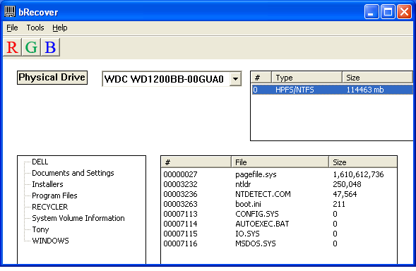

**bRecover**

A Win32 tool for parsing NTFS

Written late 2000's, I was doing a lot of data recovery and wanted to learn more about how NTFS worked. 

* brecover
    * bRecover.cpp - WinMain() entry point
    * cntfs.cpp - Load and parse NTFS
    * initcon.cpp - Sets up toolbar and controls
    * mftdialog.cpp - Dialog for loading and displaying individual MFT records
    * ntfsfunc.cpp - Manage treeview of MFT records
    * physical.cpp - Manage listview of physical drives

**Screenshot**
    

